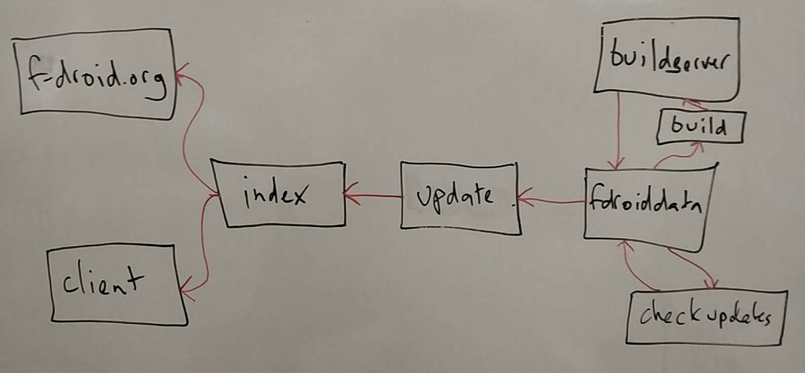

The F-Droid ecosystem has lots of moving pieces, this is an overview of those pieces.  Please add details and correct omissions.

## The index

The index is the listing of all apps included in a repository, including the
active versions, metadata about each version, the descriptive texts and
translations, and links to graphics and screenshots.

## fdroidclient

The client downloads the index of apps and puts that into a local database.  The
UI then gets the data from the local database.  This means the client works
well in places where the internet connectivity is spotty, and it is possible to
browse app the apps without any internet connection at all.  Given that
architecture, it makes sense to have the search handled all locally on the
device as well. Then search works without internet, or when it the connectivity
is bad

There are also privacy gains to this architecture, since the server does not see
what the users are doing.

## fdroid-website

The website is completely statically generated using Jekyll.  The app listing
are generated by downloading the index and generating a page for each app entry.

## search.f-droid.org

The search downloads the index and puts selected fields into a database with
various weighting and search indexing.

# List of helpful links
1. [All our APIs](https://f-droid.org/en/docs/All_our_APIs/)

