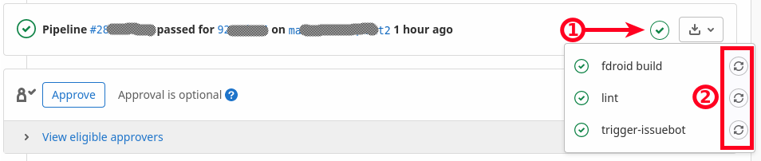

As the name suggests, this page collects questions asked frequently and puts some answers to them – so we don't have to answer them over and again.

**Contents:**

[[_TOC_]]

## General
### How long does it take for my app to show up on website and client?
Your MR has just been merged, but the APK did not show up immediately? That's normal: the APK must first been built on the build server (happens automatically when the next build cycle starts), then signed (manual step), then a new index must be created and deployed.

* a build cycle currently takes about 36h
* manual signing happens afterwards
* next build cycle starts after signing

So if you're lucky, it takes 2 days (new build cycle just started minutes after the merge). If your not-that-lucky (merge happened a minute after a build cycle started), it will take 4 days. If you're very unlucky, Murphy visits in between with some problems… So no panic before 5 days have passed, please :wink:

Please also note that the website is updated asynchronously – so while the index might already have reached your local client, website might still be a bit behind.

### Can I see the current build status?
Sure: for this we have the [F-Droid Monitor](https://monitor.f-droid.org/builds) where you can see the current build cycle ([running](https://monitor.f-droid.org/builds/running)), the last completed one ([build](https://monitor.f-droid.org/builds/build)), [disabled](https://monitor.f-droid.org/builds/disabled) builds, and more. Historical builds can be found in the [Build activity](https://f-droid.org/wiki/index.php?title=Special:RecentChanges&hidebots=0&days=30&limit=500) logs.

If you want to check the last build of a specific app, see

    https://f-droid.org/wiki/index.php?title=<package_name>/lastbuild&redirect=no

(after replacing `<package_name>` by the app's package name of course).

## Merge Requests
### Why do we always ask for static values on versionCode/versionName in `build.gradle`?
> fdroidserver has to check 2753 repositories for updates every build cycle. If we spend, for example, as little as 30 seconds for each, this will be 23 hours. Thus, updates checking needs to be fast. We cannot afford launching a virtual machine (like we do for building apps) for that.
>
> Those constraints impose a big limitation: we can't run build.gradle to find new values of versionCode and versionName because this is untrusted code. We can only rely on static analysis of build.gradle contents. Currently fdroidserver recognizes versionCode and versionName only when they are defined as literals.

([source](https://gitlab.com/fdroid/fdroiddata/-/merge_requests/6570#note_353356522); note the number of repositories has quite increased since, and long passed 3k)

### How can I trigger the bot/build to run again?
Pipelines are run automatically whenever a new commit was pushed to the merge request. However, sometimes there's no update needed for the MR itself, as fixes have been applied in the app's source repo – or some pipeline failed for other reasons, like network errors. The account that opened the merge request (as well as members with status developer and up) can always trigger the pipelines again:

Members with status developer and up usually can trigger them too – unless the source branch is protected. So please make sure to use a separate branch when opening merge requests – as the `master`/`main` branch is always protected in GitLab.

**Note:** clicking on the *name* of the job (left of the ② in above screenshot) will bring you to the corresponding logs. This way you can e.g. figure out why a build failed – or what labels *issuebot* would have applied to the MR (similar to what it does on RFP) if it had "higher privileges".

### Can I obtain the `*.apk` your CI built?
It can be quite helpful to get your hands on that, yes. And you easily can

* **CI build:** click on *fdroid build* (shown in above screenshot), then use the "browse" button on the right side of the opening page, navigate to the `unsigned/` directory.
* **Issuebot:** If the issuebot report says "`<com.example.packageName>` builds", follow the final link of that report. Again, the `*.apk` is available in the `unsigned/` directory.