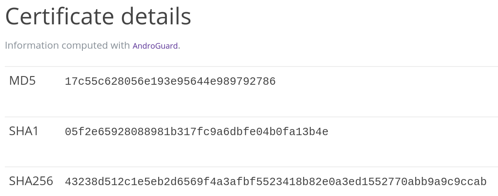
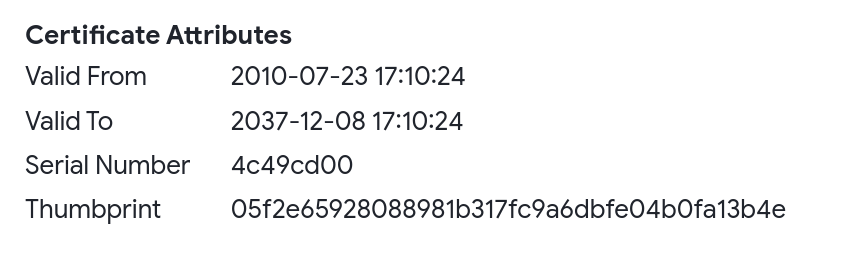
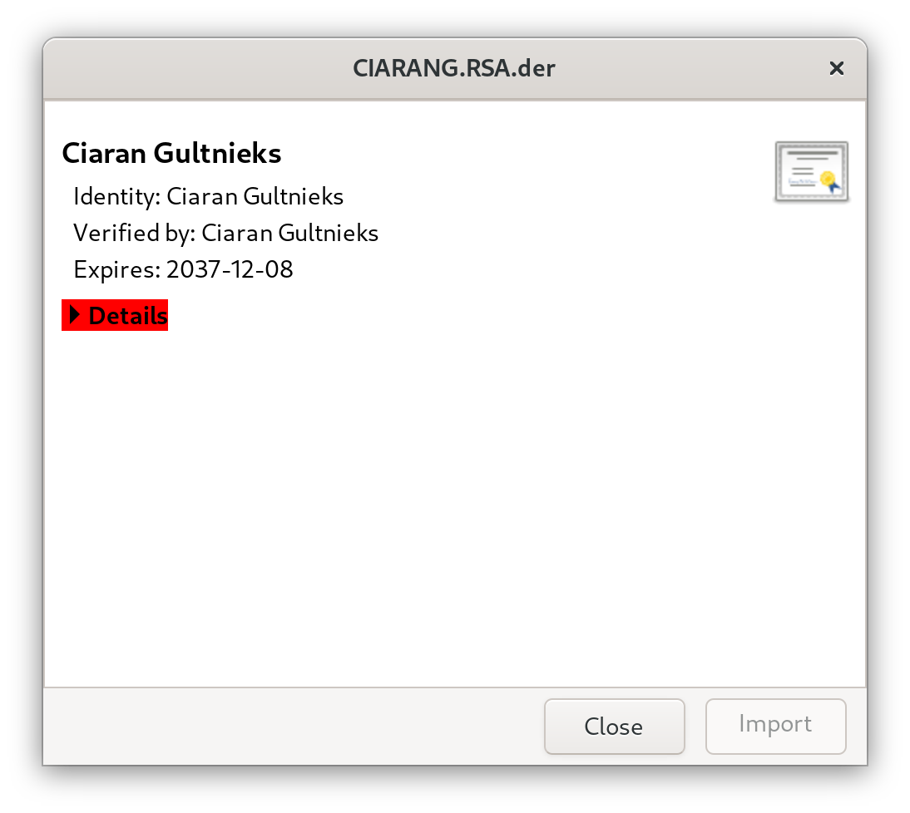
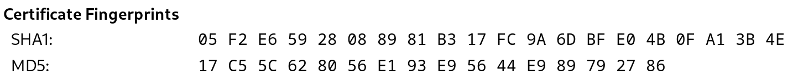

As the name suggests, this page collects questions asked frequently and puts some answers to them – so we don't have to answer them over and again.

**Contents:**

[[_TOC_]]

## General

### How long does it take for my app to show up on website and client?

Your MR has just been merged, but the APK did not show up immediately? That's normal: the APK must first be built on the build server _(happens automatically when the next build cycle starts)_, then signed _(manual step)_, then a new index must be created and deployed.

* a build cycle currently can take up to 72h _(hard limit)_
* apps are manually signed after that _(if not reproducible)_, and then uploaded
* next build cycle starts after signing is completed

So if you're lucky, it takes 3 days _(new build cycle just started minutes after the merge)_. If you're not-that-lucky _(merge happened a minute after a build cycle started)_, it will take 6 days. If you're very unlucky, Murphy visits in between with some problems… So don't panic before 7 days have passed, please. :wink:

Please also note that the website is updated asynchronously – so while the index might already have reached your local client, website might still be a bit behind.

### Can I see the current build status?

Sure: for this we have the [F-Droid Monitor](https://monitor.f-droid.org/builds) where you can see the current build cycle ([running](https://monitor.f-droid.org/builds/running)), the last completed one ([build](https://monitor.f-droid.org/builds/build)), [disabled](https://monitor.f-droid.org/builds/disabled) builds, and more.

### How exactly does the building process work?

Several stages happen before an app update is published. In this page, we will explain all the steps that happen.

#### Finding updates

First, F-Droid checks for app updates. To see if the update has been detected, look at the app in the [metadata](https://gitlab.com/fdroid/fdroiddata/-/tree/master/metadata) directory of fdroiddata _(for example, in F-Droid's case the file is [org.fdroid.fdroid](https://gitlab.com/fdroid/fdroiddata/-/blob/master/metadata/org.fdroid.fdroid.yml))_. The list of known versions is listed under the `Builds` key.

If the latest version isn't under `Builds` yet, `checkupdates` either hasn't found the build yet, automatic updates aren't enabled for the app or something changed in the source code and it can't be detected. Please give it at least 2 days and check [fdroiddata](https://gitlab.com/fdroid/fdroiddata) `Issues` and `Merge Requests` to see if anyone is working on it.

#### Build cycle

Each build cycle starts at a certain fdroiddata commit. At https://monitor.f-droid.org/builds/running you can see the current cycle.

If you're lucky, you may already see your app under `Succcesful builds` _(or `Failed builds`)_. If the build failed, usually a fixed version will be tried the next build cycle or upstream will be contacted if the F-Droid team can't fix the build failure themselves.

If your app isn't listed, it either hasn't been built yet or will be part of the next cycle. On the webpage under `fdroiddata version` you can see which commit is currently building. Click this link and go to the app's entry in `metadata` again. If the latest version is under `Builds`, it is part of this cycle. If not, it will be part of the next cycle.

#### Signing

After a few days _(on average about 3)_, someone will sign all the built apps on an air-gapped machine and push the signed APK files to the F-Droid repository. You can tell this happened from an fdroiddata commit with the name [Update known apks](https://gitlab.com/fdroid/fdroiddata/-/commits/master?search=Update+known+apks). After this, a new cycle starts.

## Merge Requests

### Why do we always ask for static values on versionCode/versionName in `build.gradle`?

The checkupdate CI job has to check \~3350 repositories for updates continuously. If we spend, for example, as little as 30 seconds for each, this will be \~28 hours. Thus, updates checking needs to be fast. We cannot afford launching a virtual machine _(like we do for building apps)_ for that.

These constraints impose a big limitation: we can't run build.gradle to find new values of versionCode and versionName because this is untrusted code. We can only rely on static analysis of build.gradle contents. Currently fdroidserver recognizes versionCode and versionName only when they are defined as literals.

### How can I trigger the bot/build to run again?

Pipelines are run automatically whenever a new commit was pushed to the merge request. However, sometimes there's no update needed for the MR itself, as fixes have been applied in the app's source repo – or some pipeline failed for other reasons, like network errors. The account that opened the merge request _(as well as members with status developer and up)_ can always trigger the pipelines again:


Members with status developer and up usually can trigger them too – unless the source branch is protected. So please make sure to use a separate branch when opening merge requests – as the `master`/`main` branch is always protected in GitLab.

**Note:** clicking on the _name_ of the job _(left of the ② in above screenshot)_ will bring you to the corresponding logs. This way you can e.g. figure out why a build failed – or what labels _issuebot_ would have applied to the MR _(similar to what it does on RFP)_ if it had "higher privileges".

### Can I obtain the `*.apk` your CI built?

It can be quite helpful to get your hands on that, yes. And you easily can

* **CI build:** click on _fdroid build_ _(shown in above screenshot)_, then use the "browse" button on the right side of the opening page, navigate to the `tmp/` directory.
* **Issuebot:** If the issuebot report says "`<com.example.packageName>` builds", follow the final link of that report. Again, the `*.apk` is available in the `unsigned/` directory.

## Misc

### What are the criteria for an app to show up in the "Latest" tab?

The F-Droid client features a "Latest" tab – and there's always confusion about what shows up there and in which order. So let's sum that up:

The sorting logic [can be found here](https://gitlab.com/fdroid/fdroidclient/-/merge_requests/971/diffs#fbc34fe643b953bd45f1cc19fc874453c683b074_854_865 "convert the Latest Tab SELECT logic to ORDER BY, with accurate IS_LOCALIZED"). Don't let yourself be misled by the name "Latest" – it's not really meant as "Newest", but rather like "latest fashion"; though some of us argued `last_updated` should have a much higher weight, it in fact has not. The sorting algorithm from above linked code, put in easy words, is rather:

* pick all apps which are localized to what the user has set as their device locale
* order that by name _(nulls last; i.e. "make sure it has a name")_
* then by icon _(i.e. "has an icon", small note, the newer .xml icon format is not currently picked up, so make sure that Fastlane/Triple-T have an `icon.png`)_
* then by summary, description (i.e. has summary, has description)
* then by "has any graphic" _(screenshot, featureGraphic etc – one of them suffices)_
* then by "was just added now or updated in the last 7 days" _(ahem, this should rather compare to the index date but does not)_
* then by whether it has a "whatsNew" _(i.e. per-release changelogs in Fastlane)_
* **only then by when it was last updated** _(descending, so newest first)_
* then by when it was added _(oldest first – meaning, "this app already is with us for a long time and still well maintained")_

### How can I verify the downloaded F-Droid.apk?

Some details on this can be found in our documentation at [Release Channels and Signing Keys](https://f-droid.org/docs/Release_Channels_and_Signing_Keys/). To make it easier to understand for non-devs, here are the steps in short:

#### GnuPG

* download https://f-droid.org/F-Droid.apk.asc and https://f-droid.org/F-Droid.apk
* load the public key for admin@f-droid.org
* compare the fingerprint with what above mentioned page states
* verify the file

On Linux, this is what it would look like:

```bash
# download the files
wget -q https://f-droid.org/F-Droid.apk.asc
wget -q https://f-droid.org/F-Droid.apk
# load the public key
gpg --keyserver keyserver.ubuntu.com --recv-key 37D2C98789D8311948394E3E41E7044E1DBA2E89
# compare the fingerprint
gpg --fingerprint 0x41E7044E1DBA2E89
# verify the file
gpg --verify F-Droid.apk.asc F-Droid.apk
```

The expected output of the last command should look like:

```plaintext
gpg: Signature made Mon 09 Aug 2021 11:17:55 PM CEST
gpg:                using RSA key 802A9799016112346E1FEFF47A029E54DD5DCE7A
gpg: Good signature from "F-Droid <admin@f-droid.org>" [unknown]
gpg: WARNING: This key is not certified with a trusted signature!
gpg:          There is no indication that the signature belongs to the owner.
Primary key fingerprint: 37D2 C987 89D8 3119 4839  4E3E 41E7 044E 1DBA 2E89
     Subkey fingerprint: 802A 9799 0161 1234 6E1F  EFF4 7A02 9E54 DD5D CE7A
```

The warning can be ignored. If it disturbs you: as you verified the signature, you could express your trust to the key and sign it locally (i.e. just for you):

```bash
$> gpg --edit-key 0x41E7044E1DBA2E89
gpg> trust
3     # I trust marginally
gpg> lsign
gpg> save
```

Run `gpg -verify` again and the warning will be gone:

```plaintext
gpg: Signature made Mon 09 Aug 2021 11:17:55 PM CEST
gpg:                using RSA key 802A9799016112346E1FEFF47A029E54DD5DCE7A
gpg: checking the trustdb
gpg: marginals needed: 3  completes needed: 1  trust model: pgp
gpg: depth: 0  valid:   3  signed:  19  trust: 0-, 0q, 0n, 0m, 0f, 3u
gpg: depth: 1  valid:  19  signed:   1  trust: 1-, 0q, 0n, 14m, 4f, 0u
gpg: depth: 2  valid:   1  signed:   0  trust: 0-, 0q, 0n, 0m, 1f, 0u
gpg: next trustdb check due at 2021-11-05
gpg: Good signature from "F-Droid <admin@f-droid.org>" [full]
Primary key fingerprint: 37D2 C987 89D8 3119 4839  4E3E 41E7 044E 1DBA 2E89
     Subkey fingerprint: 802A 9799 0161 1234 6E1F  EFF4 7A02 9E54 DD5D CE7A
```

#### Android `apksigner`

Download the APK from the front page of https://f-droid.org, then run this:

```console
$ apksigner verify --print-certs ~/Downloads/F-Droid.apk|grep -v WARNING:
Signer #1 certificate DN: CN=Ciaran Gultnieks, OU=Unknown, O=Unknown, L=Wetherby, ST=Unknown, C=UK
Signer #1 certificate SHA-256 digest: 43238d512c1e5eb2d6569f4a3afbf5523418b82e0a3ed1552770abb9a9c9ccab
Signer #1 certificate SHA-1 digest: 05f2e65928088981b317fc9a6dbfe04b0fa13b4e
Signer #1 certificate MD5 digest: 17c55c628056e193e95644e989792786
```

#### Pithus

1. Upload the _F-Droid.apk_ you downloaded to https://beta.pithus.org/ as a "File"
2. In the resulting report, click on "APK analysis"
3. Search for the "Certificate details" section.
3. The MD5, SHA1, and SHA256 should match:


#### VirusTotal

1. Upload the _F-Droid.apk_ you downloaded to https://www.virustotal.com/
2. Search for the "Certificate Attributes" section.
3. The "Thumbprint" (SHA1 fingerprint) should match:


#### Firefox

(_This is more of a smokecheck than a full verification because Firefox can't check the signature matches META-INF/CIARANG.RSA_)

1. Download _F-Droid.apk_
2. Open it with an Archive Manager or ZIP program.
3. Find the file _META-INF/CIARANG.RSA_ and extract it as _CIARANG.RSA.der_ (*important:* the file must end in _.der_, the rest of the file name is not important)
4. Drag-n-drop the _CIARANG.RSA.der_ file onto any Firefox window, and you should see this pop up:
5. Open up the red "Details" and find "Certificate Fingerprints", that should match:
